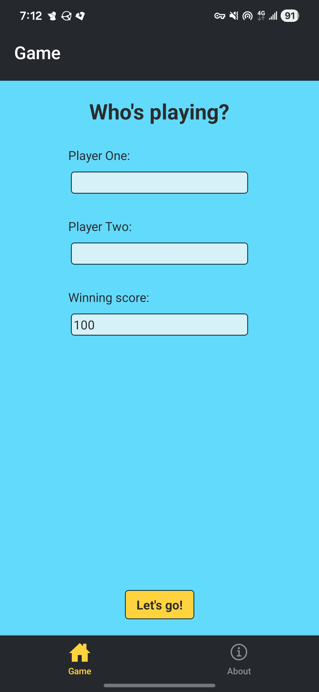
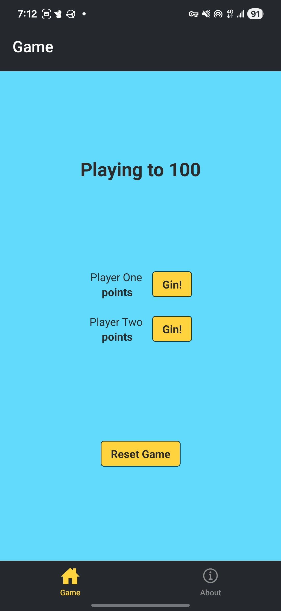
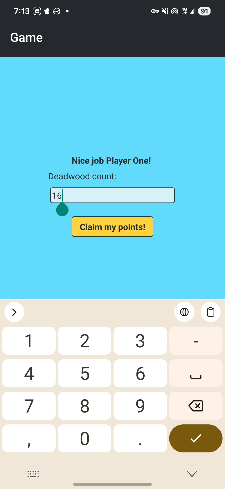
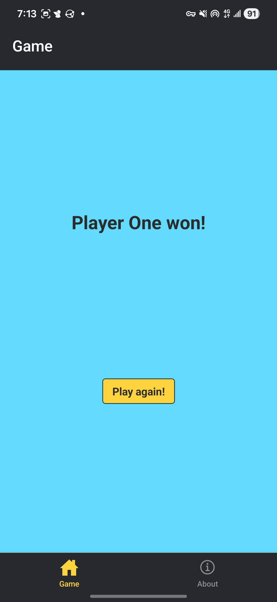

# Simple Gin Rummy Score Tracker

## Table of Contents

- [Description](#description)
- **For End Users**
   - [Where to Download the App](#where-to-download-the-app)
   - [Usage and Screenshots](#usage-and-screenshots)
- **For Developers**
   - [Installation Instructions](#installation-instructions)
   - [Technologies Used](#technologies-used)
   - [Dependencies and Credits](#dependencies-and-credits)
   - [Project Structure](#project-structure)

## Description

This app is a simple score tracker that allows two players to keep track of their scores for a game of gin rummy. If you have improvement suggestions please send them to me at grounded.wanderer@proton.me

## Where to Download the App

<!-- 
******** Add link ************
<a href="https://play.google.com/store/games"></a> 

*******     Need to get link to badge per: https://f-droid.org/docs/Badges/     ******
<a href="https://f-droid.org/packages/"></a>
-->

<a href="https://apps.obtainium.imranr.dev/redirect?r=obtainium://app/%7B%22id%22%3A%22com.groundedwanderer.ginrummy%22%2C%22url%22%3A%22https%3A%2F%2Fgithub.com%2FaRav3n%2Fgin-rummy-app%22%2C%22author%22%3A%22aRav3n%22%2C%22name%22%3A%22Gin%20Rummy%20Score%20Tracker%22%2C%22preferredApkIndex%22%3A0%2C%22additionalSettings%22%3A%22%7B%5C%22includePrereleases%5C%22%3Afalse%2C%5C%22fallbackToOlderReleases%5C%22%3Atrue%2C%5C%22filterReleaseTitlesByRegEx%5C%22%3A%5C%22%5C%22%2C%5C%22filterReleaseNotesByRegEx%5C%22%3A%5C%22%5C%22%2C%5C%22verifyLatestTag%5C%22%3Afalse%2C%5C%22sortMethodChoice%5C%22%3A%5C%22date%5C%22%2C%5C%22useLatestAssetDateAsReleaseDate%5C%22%3Afalse%2C%5C%22releaseTitleAsVersion%5C%22%3Afalse%2C%5C%22trackOnly%5C%22%3Afalse%2C%5C%22versionExtractionRegEx%5C%22%3A%5C%22%5C%22%2C%5C%22matchGroupToUse%5C%22%3A%5C%22%5C%22%2C%5C%22versionDetection%5C%22%3Atrue%2C%5C%22releaseDateAsVersion%5C%22%3Afalse%2C%5C%22useVersionCodeAsOSVersion%5C%22%3Afalse%2C%5C%22apkFilterRegEx%5C%22%3A%5C%22%5C%22%2C%5C%22invertAPKFilter%5C%22%3Afalse%2C%5C%22autoApkFilterByArch%5C%22%3Atrue%2C%5C%22appName%5C%22%3A%5C%22%5C%22%2C%5C%22appAuthor%5C%22%3A%5C%22%5C%22%2C%5C%22shizukuPretendToBeGooglePlay%5C%22%3Afalse%2C%5C%22allowInsecure%5C%22%3Afalse%2C%5C%22exemptFromBackgroundUpdates%5C%22%3Afalse%2C%5C%22skipUpdateNotifications%5C%22%3Afalse%2C%5C%22about%5C%22%3A%5C%22%5C%22%2C%5C%22refreshBeforeDownload%5C%22%3Afalse%2C%5C%22includeZips%5C%22%3Afalse%2C%5C%22zippedApkFilterRegEx%5C%22%3A%5C%22%5C%22%7D%22%2C%22overrideSource%22%3Anull%7D"></a>

## Usage and Screenshots

<div>




</div>

1. After opening the app you can enter the names of the players and, if you'd like, adjust the score that you are playing to.
2. Click **Let's go!**
3. Once a player gets a gin, click **Gin!** next to their name
4. If the player scored any additional deadwood points from their oponent's hand enter those in *Deadwood count:* then click **Claim my points!**
5. At the end of the game the winning player's name will be displayed
6. You may now exit the app or click **Play again!** to be taken back to the start screen

## Installation Instructions

1. Fork this repo
1. In your copy of the repo click the green **Code** button and copy the URL
1. If you don't have an Expo account [sign up](https://expo.dev/signup) for one
1. Open your IDE
1. ```bash
   cd YOUR_DIRECTORY_FOR_THIS_APP
   ```
1. ```bash
   git clone COPIED_URL
   ```
1. Run the following in your terminal
   - ```bash
     npm init -y
     npm install
     ```
   - ```bash
     eas login
     ```
1. ```bash react native
   npx expo start
   ```
   - If there are [issues](https://docs.expo.dev/get-started/start-developing/#having-problems) run `npx expo start --tunnel` instead
   - `^` + `c` will end the process

## Technologies Used

- <a href="https://expo.dev"> Expo</a>
- <a href="https://reactnative.dev/"> React Native</a>
- <a href="https://developer.mozilla.org/en-US/docs/Web/JavaScript"> JavaScript</a>
- <a href="https://www.typescriptlang.org/"> TypeScript</a>

### Development Tools

- <a href="https://code.visualstudio.com/"> VS Code</a>
- <a href="https://www.npmjs.com/"> NPM</a>
- <a href="https://git-scm.com/"> Git</a>

### Hosting

- <a href="https://github.com/aRav3n/gin-rummy-app"> Github</a>

## Dependencies and Credits

### Package Dependencies

- [@expo/vector-icons](https://www.npmjs.com/package/@expo/vector-icons)
- [@react-navigation/bottom-tabs](https://www.npmjs.com/package/@react-navigation/bottom-tabs)
- [@react-navigation/elements](https://www.npmjs.com/package/@react-navigation/elements)
- [@react-navigation/native](https://www.npmjs.com/package/@react-navigation/native)
- [expo](https://www.npmjs.com/package/expo)
- [expo-blur](https://www.npmjs.com/package/expo-blur)
- [expo-constants](https://www.npmjs.com/package/expo-constants)
- [expo-dev-client](https://www.npmjs.com/package/expo-dev-client)
- [expo-font](https://www.npmjs.com/package/expo-font)
- [expo-haptics](https://www.npmjs.com/package/expo-haptics)
- [expo-image](https://www.npmjs.com/package/expo-image)
- [expo-linking](https://www.npmjs.com/package/expo-linking)
- [expo-router](https://www.npmjs.com/package/expo-router)
- [expo-splash-screen](https://www.npmjs.com/package/expo-splash-screen)
- [expo-status-bar](https://www.npmjs.com/package/expo-status-bar)
- [expo-symbols](https://www.npmjs.com/package/expo-symbols)
- [expo-system-ui](https://www.npmjs.com/package/expo-system-ui)
- [expo-web-browser](https://www.npmjs.com/package/expo-web-browser)
- [react](https://www.npmjs.com/package/react)
- [react-dom](https://www.npmjs.com/package/react-dom)
- [react-native](https://www.npmjs.com/package/react-native)
- [react-native-gesture-handler](https://www.npmjs.com/package/react-native-gesture-handler)
- [react-native-reanimated](https://www.npmjs.com/package/react-native-reanimated)
- [react-native-safe-area-context](https://www.npmjs.com/package/react-native-safe-area-context)
- [react-native-screens](https://www.npmjs.com/package/react-native-screens)
- [react-native-web](https://www.npmjs.com/package/react-native-web)
- [react-native-webview](https://www.npmjs.com/package/react-native-webview)
- [react-native-worklets](https://www.npmjs.com/package/react-native-worklets)
- [@babel/core](https://www.npmjs.com/package/@babel/core)
- [@types/react](https://www.npmjs.com/package/@types/react)
- [eslint](https://www.npmjs.com/package/eslint)
- [eslint-config-expo](https://www.npmjs.com/package/eslint-config-expo)
- [typescript](https://www.npmjs.com/package/typescript)

### Other Credits

- [Devicion](https://devicon.dev/)
- [Skillicons](https://skillicons.dev/)

## Project Structure

```bash
├──.vscode/                           # settings.json lives here
├──app/                               # App pages
   ├──(tabs)/                         # Different app screens
      ├──_layout.tsx
      ├──about.tsx
      └──index.tsx
   ├──_layout.tsx
   └──+not-found.tsx
├──assets/                            # Fonts and images
   ├──fonts/                          # Fonts
      └──SpaceMono-Regular.ttf
   ├──images/                         # Image assets such as icons
      ├──screenshots/                 # Screenshots
         ├──Android/                  # Android screenshots
            ├──phone/                 # Phone screenshots
               ├──gameplay.jpg
               ├──getting_points.jpg
               ├──start.jpg
               └──victory.jpg
            ├──tablet_7/              # 7 inch tablet screenshots
               ├──gameplay.jpg
               ├──getting_points.jpg
               ├──start.jpg
               └──victory.jpg
            └──tablet_10/             # 10 inch tablet screenshots
               ├──gameplay.jpg
               ├──getting_points.jpg
               ├──start.jpg
               └──victory.jpg
         └──iPhone/                   # iPhone screenshots
            ├──gameplay.png
            ├──getting_points.png
            ├──start.png
            └──victory.png
      ├──adaptive-icon.png
      ├──favicon.png
      ├──favicon.xcf
      ├──feature_graphic.png
      ├──icon.png
      ├──icon.xcf
      ├──play_store-icon.png
      ├──splash-icon.png
      └──splash-icon.xcf
   └──styles/                    # Different app screens
├──components/                   # Smaller React components
   └──yellowButton.tsx
├──app.json
├──eas.json
├──eslint.config.js
├──expo-env.d.ts
├──LICENSE
├──package-lock.json
├──package.json
├──PRIVACY_POLICY.md
├──README.md
└──tsconfig.json
```
